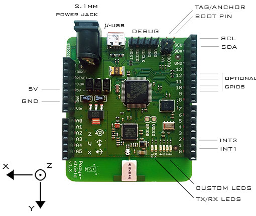

Pozyx ROS Package
====================

> Due to the lack of hardware, this goes unmaintained.

This package is made to simplify your life with the Pozyx system, using ROS. 

I am not affiliated to Pozyx and therefore I do not have all the answers.

Usage
--------------

### Setup

Connect a pozyx tag to your computer, power all anchors and tags that will be used and send the configuration with the following commands

```
roslaunch pozyx configure.launch
# or
rosparam load cfg/anchor_tags.yaml
rosrun pozyx setup_anchors.py
```

### Get a position

After configuring the system, simply start the wanted node

```
rosrun pozyx pose2D_IMU.py
# or
rosrun pozyx pose3D_IMU.py
```

Params 
    * `height` - in mm, 2D only, can be updated by publishing a Int16 to the topic `pozyx/height`
    * `algorithm` - 0 is raw, 1 is not implemented, 2 is mean square filtered
    * `remote` - 0xFFFF the address of the remote device, None for local device 
    * `port` - '\dev\ttyPozyx' if you made a udev rule
    * `posehz` - Frequency of the pose feedback (default 2Hz)
    * `imuhz` - Frequency of the imu feedback (default 100Hz)

### Range 

Make a range measurement from the remote to the destination, sent back to the local device. If remote is None, then measure the range between the local device and the destination

```
rosrun pozyx range.py destination:=0x1234 remote:=None
```

Params
    * `remote` - From whom
    * `destination` - To whom

Params
--------

Pinout
---------



The jumpers : 

* BOOT0
	* Jumper off : DFU mode
	* Jumper on : Boot
* T/A
	* Jumper off : Anchor
	* Jumper on : Tag

Firmware update
---------

### On Windows

Follow the Tutorial on the Pozyx website

### On Linux

Set Udev rules

```
# execute https://github.com/dhylands/usb-ser-mon/blob/master/mk-udev-rules-stm32.sh
```

Install and use dfu-util

```
sudo apt-get install dfu-util
dfu-util --device 0483:df11 --alt 0 -D /home/unmanneddemo2/Downloads/firmware_v1.0.dfu
```

Roadmap 
--------

Here are all the nodes to be done. If you feel awesome, leave an issue with the part you will PR, and feel free to give your ideas if you think there is a missing node!

* [x] Multiple anchor setup
* [ ] UWB settings setup
* [x] 2D position reading with variable height & IMU 90Hz
* [x] 3D position reading & IMU 90Hz 
* [x] Ranging between two tags
* [ ] Robot_pose_ekf integration
* [ ] Positioning of a remote tag
* [ ] Positioning of all tags
* [ ] Tags discovery
 
Contributing
--------

Feel free to contribute and make a pull request to add functionnalities.

Credits
--------

* Alexis Paques (@AlexisTM)

